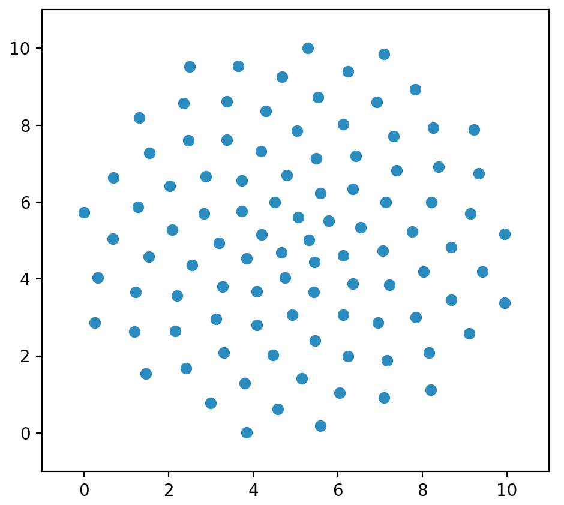
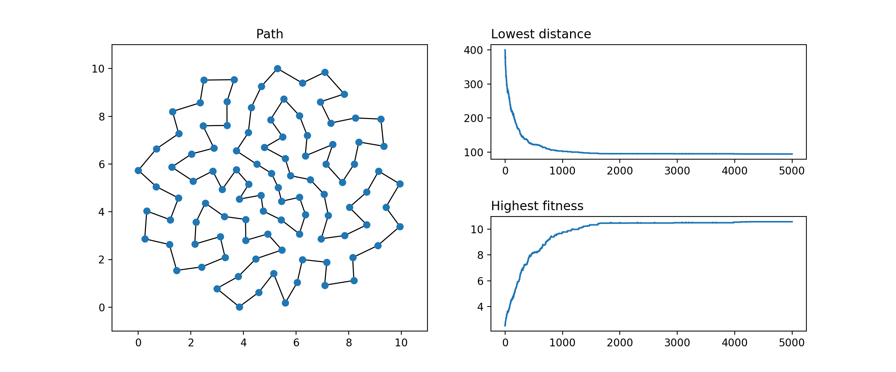

# Genetic Algorithm TSP on 100 Points
A simple example of a fast solution to a hard Travelling Salesman Problem for 100 points!

### Problem
Visit each point only **once** while traversing the **shortest path** possible

### Solution
(h)eureka!

### Observations for this problem
**Selection:** Tournament > Wheel

**Crossover:** Generates one offspring – segment from the first parent and leftovers from the second (PMX)

**Mutation:** Three types of mutations at once of equal chances (~33%)

**Number of (brute-force) permutations:** 100! < 9332621544 * 10^148 which is basically 9332621544 and 148 zeros of possible routes. This definitely displays the power of heuristic algorithms
